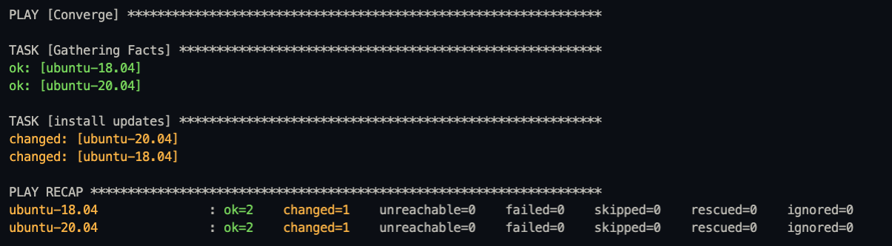
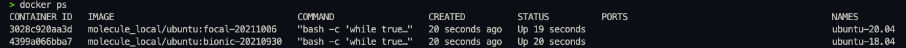
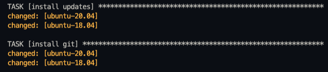
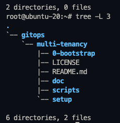

# Ansible Molecule 
[Watch Ansible Molecule شرح step by step on YouTube](https://youtu.be/no8ZM1F7rhA)


Make sure you have the following installed:

        Note
        -  Make sure you have python & pip 
        -  Make sure that your on the right directory.

Installing [pip / pip3](https://github.com/pypa/pip)

```
python get-pip.py
```

Installing all requirments using pip _(make sure you stand inside the directory that contains the requirements file)_

```
pip3 install -r requirment.txt
```

Installing [Ansible](https://github.com/ansible/ansible.git), [Ansible-lint](https://github.com/ansible-community/ansible-lint.git) & [Molecule](https://github.com/ansible-community/molecule.git)

```
brew install ansible
brew install ansible-lint
brew install molecule
```

Installing [Molecule Vagrant](https://github.com/ansible-community/molecule-vagrant.git)

```
pip3 install molecule-vagrant
```

Installing [Test Infra](https://github.com/pytest-dev/pytest-testinfra.git)

```
pip3 install pytest-testinfra
or
pip install 'git+https://github.com/pytest-dev/pytest-testinfra@master#egg=pytest-testinfra'
```

Installing [Ansible-Elasticsearch](https://github.com/elastic/ansible-elasticsearch.git)

```
ansible-galaxy install elastic.elasticsearch,v7.17.0
```
---
To write the molecule.yml file you need to get the [image-info](https://hub.docker.com/_/ubuntu) you will be using.

Make sure that your creating the files under that path molecule/default then Run the following command to start testing:
```
molecule test
```
   Note: If you got this error:
         ```    
         ERROR: Failed to pre-validate. {'driver': [{'name': ['unallowed value docker']}]}
         ```- Therefore you need to install molecule-docker package.

```
pip3 install molecule-docker
```

Re-run the molecule test command again and make sure you get this output


---

Create the docker containers _(make sure you are one step back from the molecule directory )_

```
cd ../../
molecule create
```
Verify by running `docker ps` check your containers


---

Now we have two containers we need to run the `converge.yml` playbook file on both containers to apply the tasks:

```
molecule converge
```
Once the tasks are applied you should be able to verify it through your terminal i.e:



After applying all tasks `(Install update, install git, clone repo, create sh script ..etc)` we need to verify that by logging in to the containers.

```
molecule login -h ubuntu-18.04
or
molecule login -h ubuntu-20.04
or 
docker exec it <CONTAINER ID> bash
```


---

Adding text to the README file for the repo that was cloned by adding that task.
```
    - name: add text to README.md file
      blockinfile:
        path: "root/<PATH>"
        block: |
          # I AM HERE
```
Adding a `Sriptfile` and giving it executable permisions:

```
    - name: create sh script
      file:
        path: "{{root}}script.sh"
        state: touch
```
Inserting text into the script or commands

```
    - name: insert text into script
      lineinfile:
        path: "{{root}}script.sh"
        line: "echo WELCOME-MOLECULE"
```
Adding permisions

```
    - name: set executable permission for script.sh
      ansible.builtin.file:
        path: "root/script.sh"
        state: touch
        mode: u=rwx,g=rwx,o=rwx
```
Delete containers

```
molecule destroy
```
molecule converge
```

# Step 5:

When you are done and would like to remove the containers:

```bash
molecule destroy
```

# Get inside the containers:

Use the following command to see the created machine names:

```bash
molecule login
```

Use the following command to get inside the container:

```bash
molecule login -h <machine-name>
```

# For Testing:

You can run this to test creating > running converge > and destroy all at once:

```bash
molecule test
```
