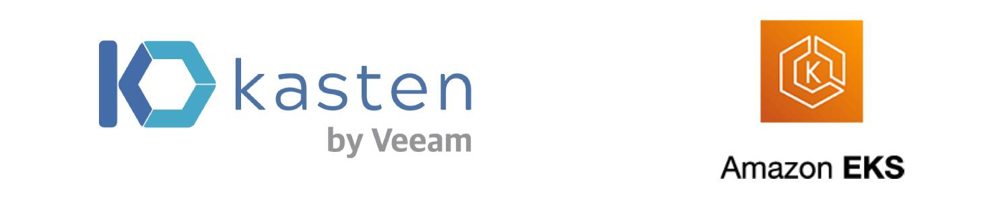

# EKS Cluster Backup with Kasten (K10)



### Initial Requirements

For the required initial setup, please run the prerequisites script

```
chmod +x prerequisites.sh
./prerequisites.sh
```

## Step 1: Setting Up Infrastructure

This step involves creating an S3 Bucket for backup storage and an IAM Role for Kasten's S3 Bucket access.

Set up your infrastructure with these Terraform commands:

```
cd Terraform

terraform init

terraform plan

terraform apply -auto-approve
```

## Step 2: Launching Cluster and Application

Deploy the cluster and application with this Ansible command:

```
ansible-playbook aws-eks-app-deploy.yaml
```

## Step 3: Kasten Installation on AWS

Deploy Kasten using the **kasten-deployment.sh** script:

```
cd Terraform

chmod +x kasten-deployment.sh

./kasten-deployment.sh
```

This process involves:

1. Conducting a deployment pre-check
2. Updating kubeconfig
3. Associating OIDC with the cluster
4. Adding Kasten's helm repository
5. Creating a Kasten-specific namespace
6. Installing Kasten with helm
7. Pausing briefly (1 minute) for pod startup
8. Refreshing the helm repo and updating Kasten
9. Configuring external LoadBalancer access for Kasten
10. Displaying Kasten's URL
11. Providing a Kubernetes token for Kasten login

## Delete Kasten Deployment

To remove the Kasten setup, utilize the **delete-kasten-deployment.sh** script:

```
cd Terraform

chmod +x delete-kasten-deployment.sh

./delete-kasten-deployment.sh
```

## Delete Cluster and Application

To dismantle the cluster and application:

```
ansible-playbook aws-eks-app-remove.yaml
```
