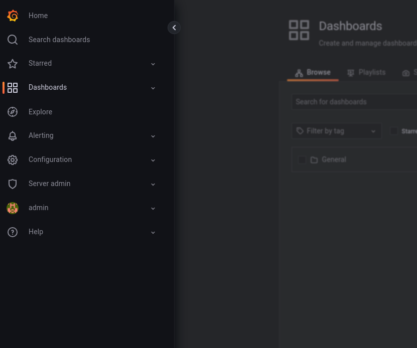
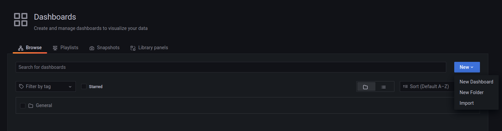

# Deploy Go App on EKS

This application is a simple survey where the go app run on `localhost:8080` and when you send a `POST` request as a `JSON` format it will be added automatically in the `MONGODB` database.

## 1. Deployment:

```
chmod +x deploy.sh

./deploy.sh
```

### This script including the following:

1. Building the infrastructure:

- (Kubernetes Cluster) `EKS`
- (Container Registry) `ECR`
- (Storage Bucket) `S3`
- Deploy `Ingress`
- Deploy `Monitoring` (Prometheus, Alertmanager, Grafana)
- Update the `kubeconfig`
- Build the `Docker image`
- Login and push the `Docker image` to the `ECR`
- Create `Namespace` for the app
- Deploy the application

## 2. Access Grafana:

`NOTE:` Find `Grafana` URL in terraform/monitoring.tf (change the host with your desired domain)

```
hosts:
  - grafana.johnydev.com
tls:
  - secretName: grafana-tls
    hosts:
      - grafana.johnydev.com
```

### Grafana Credentials:

```
UserName: admin
Password: admin
```

## 3. Monitoring Dashboard:

### a) Navigate to Dashboard



### b) Import Dashboard number `741`



## 4. Load Testing:

`NOTE:` To run load test from your machine you will need to first install [k6](https://k6.io/docs/get-started/installation/)

### Run the existing Load test script:

```
k6 run k6.js
```

`You can customize your own load test script from:` [HERE](https://k6.io/docs/get-started/running-k6/)

## 5. Delete Everything:

### `NOTE:` You can delete everything by running the `delete.sh` Script which will do the following:

- Delete Docker image from the `ECR`
- Delete application deployment
- Delete application Namespace
- Destroy the infrastructure

```
chmod +x delete.sh

./delete.sh
```
