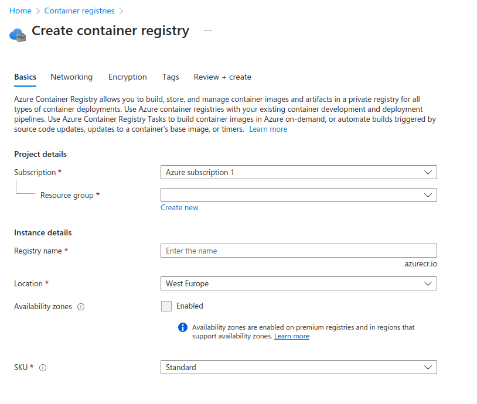
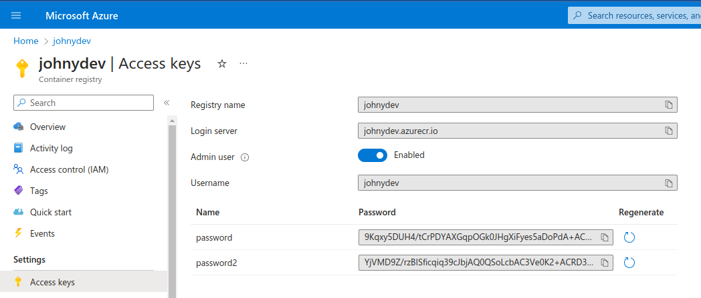

# Build and push docker image to ACR

This project is to build and push docker image to Azure Container Registry using github actions workflow.

### Step 1: Create `Container Registry` on Azure Portal
`NOTE:` You will need to attach it to a `resource group` or create a new one and give it a name

### Step 2: Get `ACR_PASSWORD`:

1. Once the `Container Registry` is created, navigate to `Access Keys` in the left panel
2. Enable the `Admin user` to get the generated password

### Step 3: Add `Variables` to `GitHub Secrets`

1. Navigate to your `github repository` >> `Settings` >> `Secrets and Variables` >> `Actions`
2. Create `New Repository Secret`
3. Add the `ACR_USERNAME` (which is the name of the registry in this example: johnydev)
4. Add the `ACR_PASSWORD` (which is the generated password)

---

### What is the variable `${{ github.sha }}` in the workflow?

`github.sha` is an environment variable in GitHub Actions that contains the SHA hash of the commit that triggered the workflow. It represents the unique identifier of the current commit being built and can be used to create a unique tag or label for the Docker image.
