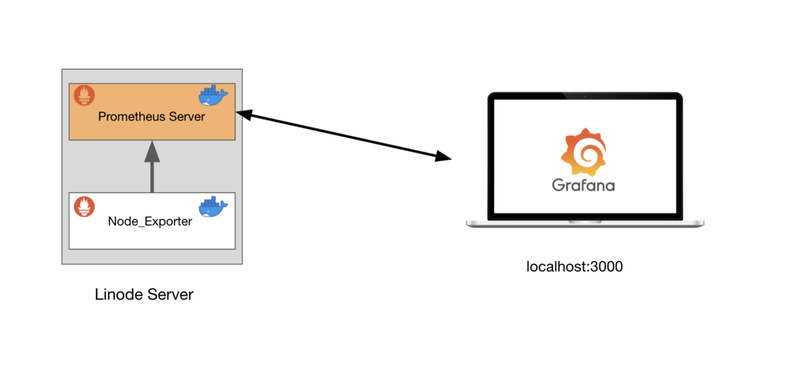

# Locally Monitoring using Node Exporter into Docker



## Step 1: Run Portainer into Docker

Use the steps in the following [LINK](https://github.com/johnbedeir/Devops-Tools-Documentation/tree/main/Docker/Portainer_Docker) to run Portainer locally using Docker

## Step 2: Create a stack on Portainer

### 1. Create a Stack on Portainer named `monitoring`
### 2. Copy what's in the `node-exporter/docker-compose.yml` into the stack web editor and deploy the stack

## Step 3: Run Prometheus into Docker

### What this commands will do?

#### 1. Create a docker volume prometheus_data
#### 2. Run a container named prometheus-docker
#### 3. Using port 9090
#### 4. Set persistent volume name to prometheus_data
#### 5. Attach the container to network `monitoring_default`
#### 6. Create the container from the image prom/prometheus

```
docker volume create prometheus_data
```
```
cd prometheus_config/

docker run -d --name prometheus-docker -p 9090:9090 --mount type=bind,source=$PWD/prometheus.yml,target=/etc/prometheus/prometheus.yml --network monitoring_default prom/prometheus
```

## Check Node Exporter is up and running

```
http://localhost:9090
```

Navigate to `Status` / `Targets` to see if node-exporter is up and running

## Step 3: Run Grafana into Docker

### What this command will do?

#### 1. Create a docker volume grafana_data
#### 2. Run a container named grafana-docker
#### 3. Using port 3000
#### 4. Set persistent volume name to grafana_data
#### 5. Set persistent volume path to /var/lib/grafana
#### 6. Attach the container to network `monitoring_default`
#### 7. Create the container from the image grafana/grafana

```
docker volume create grafana_data
```
```
docker run -d --name grafana-docker -p 3000:3000 -v grafana_data:/var/lib/grafana --network monitoring_default grafana/grafana
```

## Step4: Connect Grafana to Pull metrics from Prometheus

1. Navigate to:
```
http://localhost:3000
```
2. Login Credentials: `you can create new password or skip`
```
username: admin
password: admin
```
3. Navigate to `Data Source` and choose `Prometheus`

4. In the `URL` field add your `Machine IP` followed by Prometheus port `9090` to look like the following, Then `Save & Test`
```
http://IP:9090
```
5. Navigate to `Dashboard` then `Import` and use the dashboard id `1860` then `Load`
6. From the last section choose `Prometheus` then `Import`

You will be able to see all the data pulled from the node exporter presented in a nice UI
