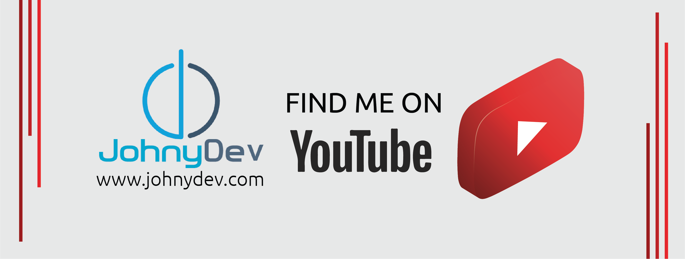
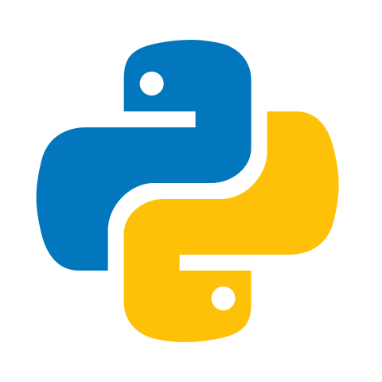
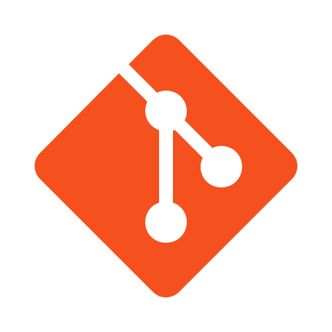
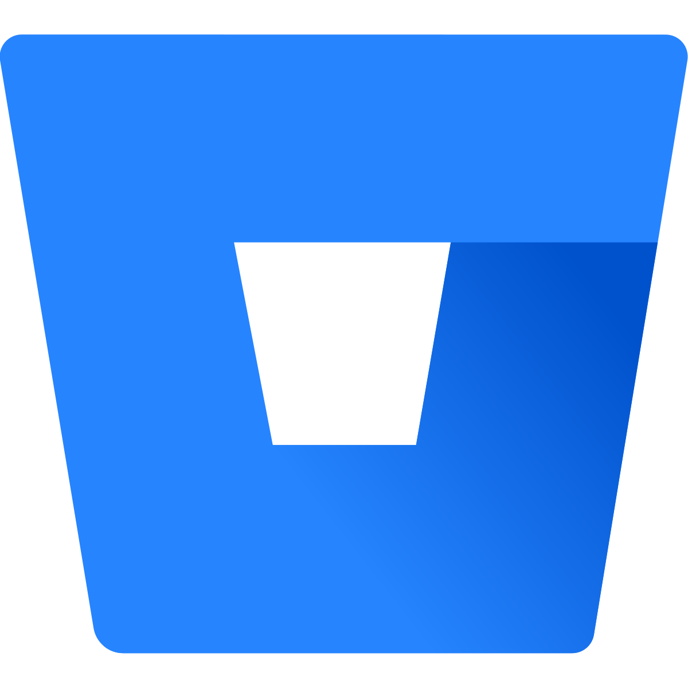
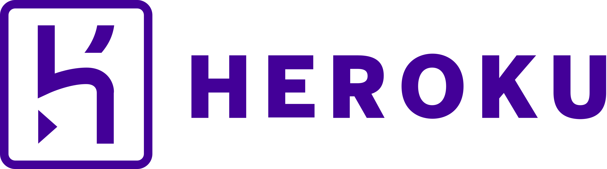
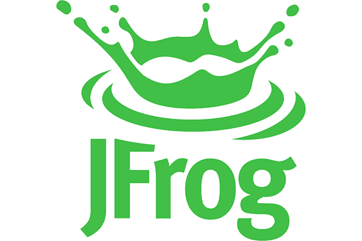
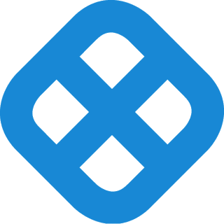
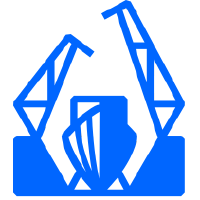
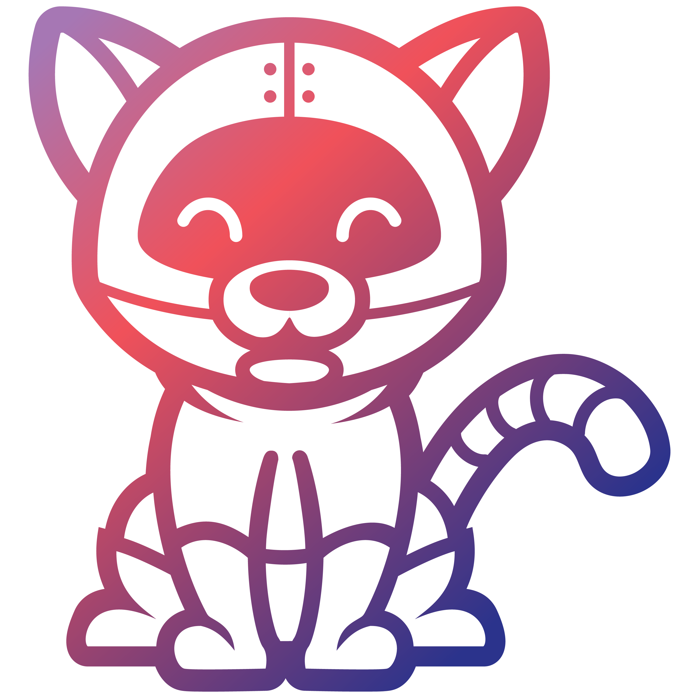
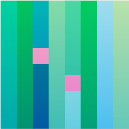

## I'm a Site Reliability Engineer!!

- 🚀 I launched Devops courses on my Youtube Channel: [Become A Devops Engineer!][course]!
- 📖 I’m currently learning everything 🤣
- 🧑🏻‍🤝‍🧑🏻 I’m looking to collaborate with other content creators
- ✅ 2023 Goal: DevSecOps and explore new DevOps tools
<!-- - ⚡ Fun fact: I love to draw and play guitar / drums -->

### Connect with me:

[][website]
[][youtube]
[][linkedin]
[][instagram]
[][facebook]

 

### Languages and Tools:

---

### 📺 Latest YouTube Videos

<!-- YOUTUBE:START -->

- [Continuous Integration with Github Actions](https://youtu.be/QDlIo97ibxY)
- [How to Deploy Python App on EKS?](https://youtu.be/3DKLAOFzqMY)
- [How to Write Kubernetes manifest for Python App?](https://youtu.be/UJ1eSRAXpik)
- [How to Write Docker Compose for Python App?](https://youtu.be/G3yldqji85Y)
- [How to Write Dockerfile for Python App?](https://youtu.be/jayujZWjLOk)
- [Vagrant (Part 4)](https://youtu.be/r3or3qlY464)
- [Vagrant (Part 3)](https://youtu.be/cINWNEbS1To)
- [Vagrant (Part 2)](https://youtu.be/Xv4I-TCzvP4)
- [Vagrant (Part 1)](https://youtu.be/uo-0PkcUze8)
- [How to Create Ubuntu VM on Azure?](https://youtu.be/16M_Gy16500)
- [How to Create Windows VM on GCP?](https://youtu.be/Llf_1mO1Uu0)
- [How to Create Ubuntu VM on GCP?](https://youtu.be/CimnP9XDwHI)
- [DevOps Pipeline - PHP](https://youtu.be/vrdlDh2GAPw)
- [Terraform (Part 2)](https://youtu.be/V6CPs_C9v8A)
- [Terraform - Part 1](https://youtu.be/zF_N4flz8lw)
- [Kubernetes (Part 3)](https://www.youtube.com/watch?v=4Tkxe0VjrYw)
- [Kubernetes (Part 2)](https://www.youtube.com/watch?v=kV4jINv3s-k)
- [Kubernetes (Part 1)](https://www.youtube.com/watch?v=YfJZBngbhM8&t=537s)
- [What is Docker?](https://www.youtube.com/watch?v=konAsZCudrA&t=1498s)
- [What is DevOps?](https://www.youtube.com/watch?v=KvZ5xyLT-Dw)
<!-- YOUTUBE:END -->

➡️ [more videos...](https://www.youtube.com/channel/UCxvd-DdyFsE_07lCa4kRINA)

---

[website]: https://johnydev.com
[youtube]: https://www.youtube.com/channel/UCxvd-DdyFsE_07lCa4kRINA
[instagram]: https://www.instagram.com/johnbedeir/
[linkedin]: https://www.linkedin.com/in/johnbedeir/
[course]: https://www.youtube.com/@JohnyDev
[facebook]: https://www.facebook.com/JohnyDev-293895207431248

<!--  -->
