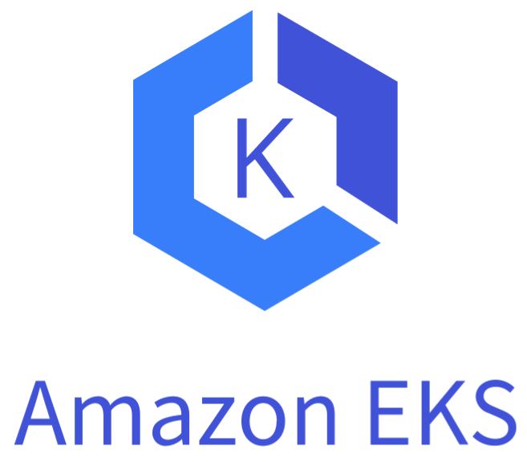

# Terraform AWS EKS with RDS Project

 &nbsp;  &nbsp; 

## Overview

This Terraform project automates the deployment of an Amazon EKS (Elastic Kubernetes Service) cluster along with an RDS (Relational Database Service) instance in the same VPC across two Availability Zones. The setup includes a Cluster Autoscaler deployed via Helm, ensuring efficient scaling of your Kubernetes cluster. Additionally, this project incorporates AWS Secret Manager for secure storage of RDS credentials.

## Features

- **Amazon EKS Deployment:** Automated setup of a managed Kubernetes cluster.
- **Amazon RDS Instance:** Provisioning of an RDS instance in the same VPC as EKS.
- **Multi-AZ Deployment:** Ensures high availability by spanning resources across two Availability Zones.
- **Cluster Autoscaler:** Dynamically scales the nodes in the EKS cluster.
- **AWS Secret Manager Integration:** Secure storage of RDS credentials.

## Prerequisites

- Terraform installed
- AWS CLI configured with appropriate permissions
- Kubernetes and Helm CLI tools for managing the EKS cluster

## Usage

1. **Clone the Repository:**

   ```bash
   git clone https://github.com/johnbedeir/Devops-Tools-Documentation.git
   cd Devops-Tools-Documentation/Terraform/AWS/EKS-with-RDS
   ```

2. **Initialize Terraform:**

   ```bash
   terraform init
   ```

3. **Plan the Deployment:**

   ```bash
   terraform plan
   ```

   Review the plan to ensure the correct resources are being created.

4. **Apply the Configuration:**

   ```bash
   terraform apply
   ```

   Confirm the deployment when prompted.

5. **Access the Cluster:**

   - Update your kubeconfig file using the AWS CLI:

   **In this project the [cluster-name] is** `cluster-1-test` **and the region is** `eu-central-1`

   `NOTE: You can change those names from the` **variables.tf** `file`

   ```bash
   aws eks update-kubeconfig --name [cluster-name] --region [region]
   ```

   - Configure kubectl to connect to your new EKS cluster.

6. **RDS Access:**

   - Retrieve RDS credentials from AWS Secret Manager.
   - Connect to the RDS instance using the MySQL command:

   For the `USERNAME` and `PASSWORD` you need to create `terraform.tfvars` file and store them there

   ```bash
   mysql -h [rds-endpoint] -P 3306 -u [USER] -p[PASSWORD]
   ```

   - Replace `[rds-endpoint]`, `[USER]`, and `[PASSWORD]` with your actual RDS endpoint, username, and password.

   `NOTE: It is recommended to not add your password in the command you can end the command with` **-p** `then you will be asked to enter your password`
