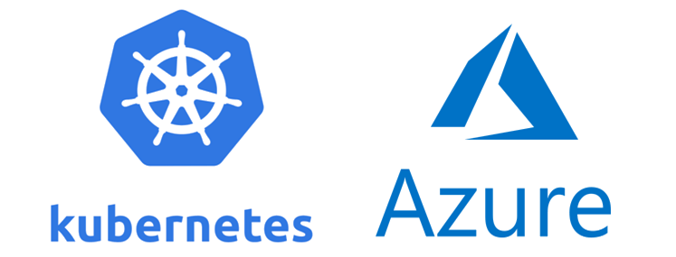

# Create Kubernetes Cluster on Azure using Terraform



---


## Step 1: Azure CLI Login
```
az login
```

## Step 2: Get AppID and Password
```
az ad sp create-for-rbac --skip-assignment
```
Create a file `terraform.tfvas` and use the output from Step 2 and add the appId with the password as a variables


## Step 3: Build AKS
```
tf init
tf apply -auto-approve
```
Use the output from Step 3 `resource-group-name` and the `cluster-name` and replace it in Step 4

## Step 4: Get AKS Kubeconfig
```
az aks get-credentials \
--resource-group resource-group-name \
--name cluster-name \
--file ./kubeconfig
```

### `NOTE: If you will use K9s to view your cluster you can copy what's inside .kubeconfig and past it inside ~/.kube/config`
